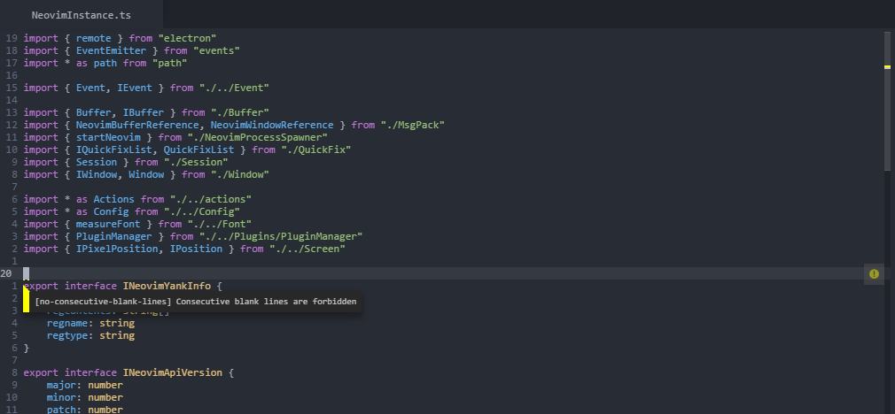

# oni-language-tslint
## TSLint Plugin for [Oni](https://github.com/extr0py/oni) 

TSLint support for Oni leverages the [TSLint](https://github.com/palantir/tslint) linter from [Palantir](http://palantir.github.io)

## Usage

To get started:

- Clone repository into your oni plugin path (~/.oni/plugins)
- Run `npm install` in the cloned path
- Restart Oni

For best results, you should have a `tslint.json` file defined. You can find information about the specification [here](https://palantir.github.io/tslint/usage/tslint-json/)

## Features

There is an experimental 'fix errors' command available in the command-palette, accessible by `<C-P>`
